<h1 align="center">SQL - Implementation of a Relational Database</h1> 

This hands-on consists of three main parts:

The first one is about creating a database and manipulating information in it.
The second one involves setting up a more complex database and retrieving information from it.
The last part  is to automate database manipulation by putting the commands into a Python script.

[oracle site: https://www.oracle.com/database/what-is-database/]:
A database is an organized collection of structured information, or data, typically stored electronically in a computer system. A database is usually controlled by a database management system (DBMS). Together, the data and the DBMS, along with the applications that are associated with them, are referred to as a database system, often shortened to just database.

### Database Creation for the hands-on:

to complete our hands-on, we are going to install PostgreSQL, which is an open-source, advanced object-relational DBMS, using its Docker image. To do this, we create a docker-compose.yaml file in a dedicated folder and define the following setup:

```
version: '3.8'
services:
  db:
    container_name: pg_container
    image: postgres:16-alpine
    restart: always
    environment:
      POSTGRES_USER: afa_user
      POSTGRES_PASSWORD: afa_password
      POSTGRES_DB: dst_db
    ports:
      - "5432:5432"
  pgadmin:
    container_name: pgadmin4_container
    image: dpage/pgadmin4
    restart: always
    environment:
      PGADMIN_DEFAULT_EMAIL: afa@gmail.com
      PGADMIN_DEFAULT_PASSWORD: afa_data_engineer
    ports:
      - "5050:80"

```
To improve the docker-compose file, let's move sensitive information into an environment file _.env_.

```
POSTGRES_USER=afa_user
POSTGRES_PASSWORD=afa_password
POSTGRES_DB=dst_db
PGADMIN_DEFAULT_EMAIL=afa@gmail.com
PGADMIN_DEFAULT_PASSWORD=afa_data_engineer
```
The best practice is to hide the _.env_ file by adding it to the _.gitignore_ file, while creating a _.env.example_ file that will serves as documentation. This file should have the same structure as the _.env_ file but without real values as follows :

```
POSTGRES_USER=your_user
POSTGRES_PASSWORD=your_password
POSTGRES_DB=your_db_name
PGADMIN_DEFAULT_EMAIL=your_email
PGADMIN_DEFAULT_PASSWORD=your_pgadmin_password
```

Then we modify the docker-compose.yml to use these environment variables:

```
version: '3.8'
services:
  db:
    container_name: pg_container
    image: postgres:16-alpine
    restart: always
    environment:
      POSTGRES_USER: ${POSTGRES_USER}
      POSTGRES_PASSWORD: ${POSTGRES_PASSWORD}
      POSTGRES_DB: ${POSTGRES_DB}
    ports:
      - "5432:5432"
  pgadmin:
    container_name: pgadmin4_container
    image: dpage/pgadmin4
    restart: always
    environment:
      PGADMIN_DEFAULT_EMAIL: ${PGADMIN_DEFAULT_EMAIL}
      PGADMIN_DEFAULT_PASSWORD: ${PGADMIN_DEFAULT_PASSWORD}
    ports:
      - "5050:80"
```
To run the docker-compose file : 
```
docker-compose up -d
```

<p align="center">
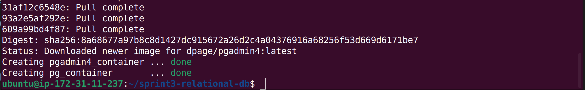
</p>
<p align="center" style="font-weight: bold;">
Figure 1: Launch our containers
</p>

to check the running containers : 
```
docker ps
``` 
Here is the output showing the docker containers that are currently running :

<p align="center">
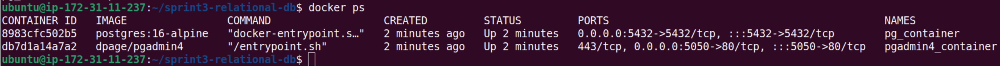
</p>
<p align="center" style="font-weight: bold;">
Figure 1: output running containers
</p>


We see that we have two running containers, named *_pg_container_* and  *_pgadmin4_container_*, respectively.

To access the container and run bash commands :
```
docker exec -it pg_container bash
```

To create the database : 

```
createdb -h localhost -U afa_user <db_name>
```

To connect to the DB :
```
psql -h localhost -U afa_user <db_name>
```

to list the existing DB : 
```
\l
```

<p align="center">
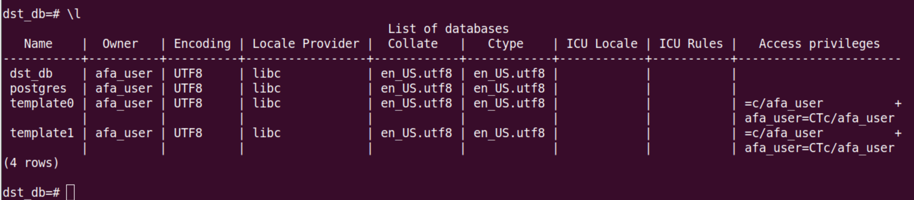
</p>
<p align="center" style="font-weight: bold;">
Figure 2: Display the existing databases
</p>


To create a database : 
```
CREATE DATABASE <db_name>;
```

### Part 1: Creating the tables:

Considering the dataset for Anime that we present in the table bellows : 

<p align="center">
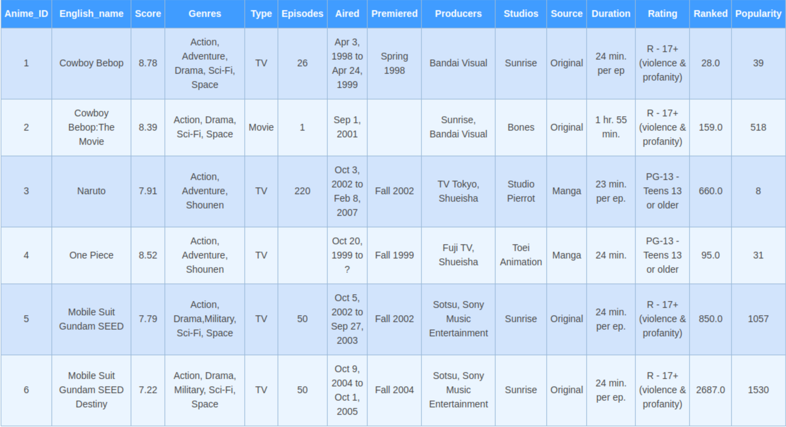
</p>
<p align="center" style="font-weight: bold;">
Figure 4: Anime dataset
</p>

Using the MERISE method, we are building an Logical Data Model (LDM) for this dataset while following the rules.

MERISE is a method for designing, developing, and implementing IT projects.
It is based on the separation of data and processes into multiple conceptual and physical models. 

The figure below illustrates the different steps through which we pass from the dataset to achieve the Physical Data Model (Modèle Physique de Données), which is the final step of database design before implementation.

<p align="center">
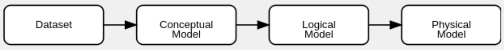
</p>
<p align="center" style="font-weight: bold;">
Figure 5: steps of Merise method
</p>

#### Construction of the Logical Data Model (MLD - Modèle Logique de Données)
The proposed structure is justified by normalization principles, separation of concerns, relationship management between entities, and model scalability. It ensures the creation of a robust database that is easy to maintain and evolve.

1. Normalization
Normalization is a process aimed at eliminating data redundancy and organizing data in a consistent manner. Here’s how it applies in this case:

Eliminating Redundant Data
In the initial table, columns such as Genres, Producers, and Studios contain lists of values separated by commas (e.g., [Action, Adventure, Drama]). This violates the First Normal Form (1NF), which requires that each column contain atomic (indivisible) values.

By creating separate tables for Genre, Producer, and Studio, we comply with 1NF and avoid redundancy.

Preventing Update Anomalies
If genres, producers, or studios were stored directly in the Anime table, any modification (e.g., changing a studio’s name) would require updating multiple rows, potentially leading to update anomalies.

With separate tables, modifications only need to be made in a single location.

2. Separation of Concerns

Each table has a clear and distinct responsibility, improving maintainability and readability of the model.

- Anime: Stores basic information about an anime (name, score, type, etc.).
- Genre: Stores the different available genres.
- Producer: Stores producer details.
- Studio: Stores studio information.
- Aired: Stores broadcasting details (start and end dates).
- Premiered: Stores premiere information (season and year).

3. Relationships Between Tables

The structure allows for clear and well-defined relationships, which are crucial for a relational database.

- One-to-Many (1-n) Relationships:
An anime can have a single broadcast entry (Aired) and a single premiere entry (Premiered), but each broadcast or premiere corresponds to only one anime.
This justifies the 1-n relationships between Anime and Aired, and between Anime and Premiered.

- Many-to-Many (n-n) Relationships
An anime can belong to multiple genres, and a genre can be associated with multiple animes.
Similarly, an anime can have multiple producers/studios, and a producer/studio can be linked to multiple animes.
This justifies the use of junction tables (Anime_Genre, Anime_Producer, Anime_Studio) to properly manage n-n relationships.

4. Extensibility

The structure makes the model more flexible and scalable.

##### Adding New Genres, Producers, or Studios
If new genres, producers, or studios need to be added, a new row can simply be inserted into the corresponding table without modifying the database schema.
Adding New Information
If additional details (e.g., extra information about studios) need to be stored, they can be added to the relevant table without affecting other tables.

The following figure shows the proposed Physical Data Model, taking our arguments into account.

<p align="center">
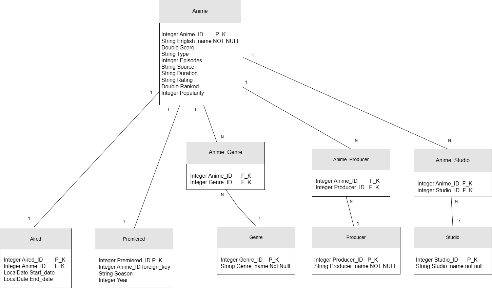
</p>
<p align="center" style="font-weight: bold;">
Figure 6: Physical model
</p>
```


### Creation of tables:

here is how to create tables and their relationships:

```
-- Table Anime
CREATE TABLE Anime (
    Anime_ID INT PRIMARY KEY,
    English_name VARCHAR(255) NOT NULL,
    Score FLOAT,
    Type VARCHAR(50),
    Episodes INT,
    Source VARCHAR(50),
    Duration VARCHAR(50),
    Rating VARCHAR(50),
    Ranked FLOAT,
    Popularity INT
);

-- Table Genre
CREATE TABLE Genre (
    Genre_ID INT PRIMARY KEY,
    Genre_name VARCHAR(50) NOT NULL
);

-- Table Producer
CREATE TABLE Producer (
    Producer_ID INT PRIMARY KEY,
    Producer_name VARCHAR(255) NOT NULL
);

-- Table Studio
CREATE TABLE Studio (
    Studio_ID INT PRIMARY KEY,
    Studio_name VARCHAR(255) NOT NULL
);

-- Table Aired
CREATE TABLE Aired (
    Aired_ID INT PRIMARY KEY,
    Anime_ID INT,
    Start_date DATE,
    End_date DATE,
    FOREIGN KEY (Anime_ID) REFERENCES Anime(Anime_ID)
);

-- Table Premiered
CREATE TABLE Premiered (
    Premiered_ID INT PRIMARY KEY,
    Anime_ID INT,
    Season VARCHAR(50),
    Year INT,
    FOREIGN KEY (Anime_ID) REFERENCES Anime(Anime_ID)
);

-- Table de liaison Anime_Genre
CREATE TABLE Anime_Genre (
    Anime_ID INT,
    Genre_ID INT,
    PRIMARY KEY (Anime_ID, Genre_ID),
    FOREIGN KEY (Anime_ID) REFERENCES Anime(Anime_ID),
    FOREIGN KEY (Genre_ID) REFERENCES Genre(Genre_ID)
);

-- Table de liaison Anime_Producer
CREATE TABLE Anime_Producer (
    Anime_ID INT,
    Producer_ID INT,
    PRIMARY KEY (Anime_ID, Producer_ID),
    FOREIGN KEY (Anime_ID) REFERENCES Anime(Anime_ID),
    FOREIGN KEY (Producer_ID) REFERENCES Producer(Producer_ID)
);

-- Table de liaison Anime_Studio
CREATE TABLE Anime_Studio (
    Anime_ID INT,
    Studio_ID INT,
    PRIMARY KEY (Anime_ID, Studio_ID),
    FOREIGN KEY (Anime_ID) REFERENCES Anime(Anime_ID),
    FOREIGN KEY (Studio_ID) REFERENCES Studio(Studio_ID)
);
```

### Data insertion queries:

```
INSERT INTO Anime (Anime_ID, English_name, Score, Type, Episodes, Source, Duration, Rating, Ranked, Popularity)
VALUES
(1, 'Cowboy Bebop', 8.78, 'TV', 26, 'Original', '24 min. per ep.', 'R - 17+ (violence & profanity)', 28.0, 39),
(2, 'Cowboy Bebop: The Movie', 8.39, 'Movie', 1, 'Original', '1 hr. 55 min.', 'R - 17+ (violence & profanity)', 159.0, 518),
(3, 'Naruto', 7.91, 'TV', 220, 'Manga', '23 min. per ep.', 'PG-13 - Teens 13 or older', 660.0, 8),
(4, 'One Piece', 8.52, 'TV', NULL, 'Manga', '24 min.', 'PG-13 - Teens 13 or older', 95.0, 31),
(5, 'Mobile Suit Gundam SEED', 7.79, 'TV', 50, 'Original', '24 min. per ep.', 'R - 17+ (violence & profanity)', 850.0, 1057),
(6, 'Mobile Suit Gundam SEED Destiny', 7.22, 'TV', 50, 'Original', '24 min. per ep.', 'R - 17+ (violence & profanity)', 2687.0, 1530);
```

```
INSERT INTO Genre (Genre_ID, Genre_name)
VALUES
(1, 'Action'),
(2, 'Adventure'),
(3, 'Drama'),
(4, 'Sci-Fi'),
(5, 'Space'),
(6, 'Shounen'),
(7, 'Military');
```

```
INSERT INTO Producer (Producer_ID, Producer_name)
VALUES
(1, 'Bandai Visual'),
(2, 'Sunrise'),
(3, 'TV Tokyo'),
(4, 'Shueisha'),
(5, 'Fuji TV'),
(6, 'Sotsu'),
(7, 'Sony Music Entertainment'),
(8, 'Bones');
```

```
INSERT INTO Studio (Studio_ID, Studio_name)
VALUES
(1, 'Sunrise'),
(2, 'Bones'),
(3, 'Studio Pierrot'),
(4, 'Toei Animation');
```

```
INSERT INTO Aired (Aired_ID, Anime_ID, Start_date, End_date)
VALUES
(1, 1, '1998-04-03', '1999-04-24'),
(2, 2, '2001-09-01', NULL),
(3, 3, '2002-10-03', '2007-02-08'),
(4, 4, '1999-10-20', NULL),
(5, 5, '2002-10-05', '2003-09-27'),
(6, 6, '2004-10-09', '2005-10-01');
```

```
INSERT INTO Premiered (Premiered_ID, Anime_ID, Season, Year)
VALUES
(1, 1, 'Spring', 1998),
(2, 2, NULL, NULL),
(3, 3, 'Fall', 2002),
(4, 4, 'Fall', 1999),
(5, 5, 'Fall', 2002),
(6, 6, 'Fall', 2004);
```

```
INSERT INTO Anime_Genre (Anime_ID, Genre_ID)
VALUES
-- Cowboy Bebop
(1, 1), (1, 2), (1, 3), (1, 4), (1, 5),
-- Cowboy Bebop: The Movie
(2, 1), (2, 3), (2, 4), (2, 5),
-- Naruto
(3, 1), (3, 2), (3, 6),
-- One Piece
(4, 1), (4, 2), (4, 6),
-- Mobile Suit Gundam SEED
(5, 1), (5, 3), (5, 7), (5, 4), (5, 5),
-- Mobile Suit Gundam SEED Destiny
(6, 1), (6, 3), (6, 7), (6, 4), (6, 5);
```

```
INSERT INTO Anime_Producer (Anime_ID, Producer_ID)
VALUES
-- Cowboy Bebop
(1, 1),
-- Cowboy Bebop: The Movie
(2, 1), (2, 2),
-- Naruto
(3, 3), (3, 4),
-- One Piece
(4, 5), (4, 4),
-- Mobile Suit Gundam SEED
(5, 6), (5, 7),
-- Mobile Suit Gundam SEED Destiny
(6, 6), (6, 7);
```

```
INSERT INTO Anime_Studio (Anime_ID, Studio_ID)
VALUES
-- Cowboy Bebop
(1, 1),
-- Cowboy Bebop: The Movie
(2, 2),
-- Naruto
(3, 3),
-- One Piece
(4, 4),
-- Mobile Suit Gundam SEED
(5, 1),
-- Mobile Suit Gundam SEED Destiny
(6, 1);
```

To show list of tables 
```
\dt
```
<p align="center">
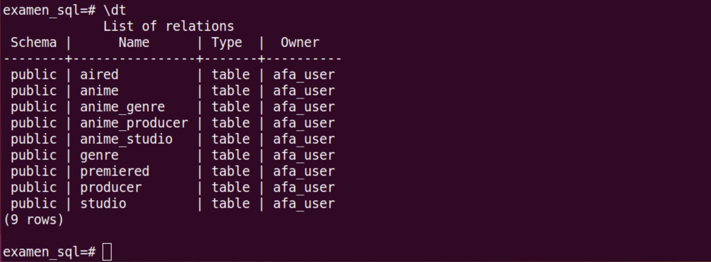
</p>
<p align="center" style="font-weight: bold;">
Figure 6: List of tables
</p>


To show details of a table 
```
\d+ <table_name>
```

<p align="center">
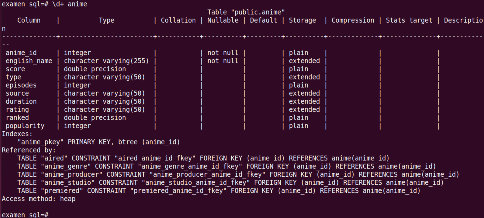
</p>
<p align="center" style="font-weight: bold;">
Figure 7: Details of table Anime
</p>

To insert data from a file, create first a file named _insert-data.sql_, whithin our container, containing all the insertion code above, and then run the following command
```
\i /path/to/insert_anime.sql
```

<p align="center">
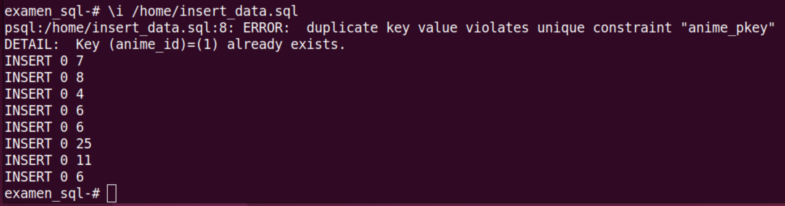
</p>
<p align="center" style="font-weight: bold;">
Figure 8: output when running the script that inserts data in tables
</p>

### Part II Perform SQL Query Execution  

Download data using this command :

```
cd && wget https://dst-de.s3.eu-west-3.amazonaws.com/bdd_postgres_fr/database/examen.sql
```
We create a database called _examen\_afa_

```
docker exec -i pg_container psql -U afa_user -d postgres -c "CREATE DATABASE examen_afa;"
```
To check that the database was created by listing all databases : 

```
docker exec -i pg_container psql -U afa_user -d postgres -c "\l"
``` 

<p align="center">
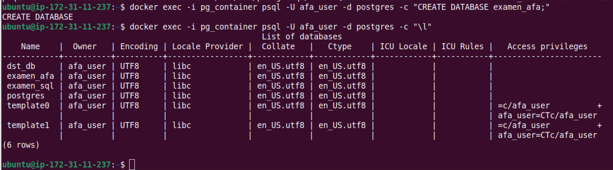
</p>
<p align="center" style="font-weight: bold;">
Figure 9: listing the existing databases
</p>

To execute the SQL script on a specified database inside a running Docker container, run this command:


```
docker exec -i <container-name> psql -U <user-name> -d <db_name> < <path-to/script-sql>
```

```
docker exec -i pg_container psql -U afa_user -d exam_afa < ./data/examen.sql
```

To display the tables created whithin the database _examen\_afa_, we run the command :

```
docker exec -i pg_container psql -U afa_user -d postgres -c "\dt"
```

<p align="center">
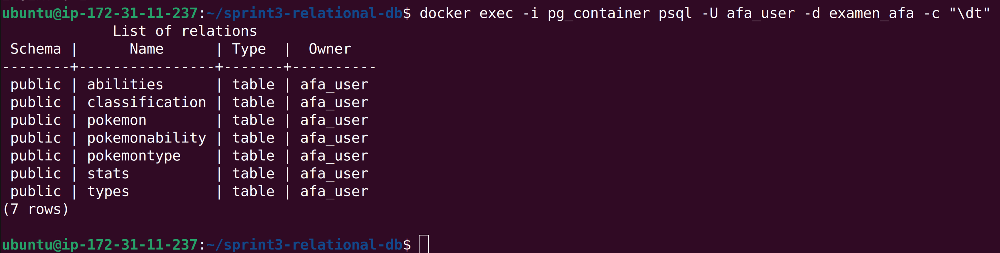
</p>
<p align="center" style="font-weight: bold;">
Figure 10: Display tables whithin the database examan_afa
</p>

#### SQL queries:

For the sake of clarity, we do not run the SQL statement from outside the container using this command:

```
docker exec -it pg_container psql -U afa_user -d examen_afa -c "SQL-statement"
```
However, we prefer connect to the database first, then run sql statements. 

This is the command to connect to the database _examen\_afa_

##### SQL query 1


```
SELECT 
    t.name_type AS type, COUNT(pt.pokedex_number) AS count 
FROM 
    pokemontype pt JOIN pokemon p 
ON 
    pt.pokedex_number = p.pokedex_number 
JOIN 
    types t 
ON 
    pt.type_id = t.type_id 
GROUP
    BY type 
ORDER
    BY count DESC;
```
This query joins the three tables (pokemon, types and pokemontype) and groups the result by type.

<p align="center">

</p>
<p align="center" style="font-weight: bold;">
Figure 11: group pokemon by type and order them according to their number, decreasingly.
</p>


##### SQL query 2
List pokemon names and base stat total grater than 600 in descending order. 

```
SELECT 
    p.name, p.base_total 
FROM 
    pokemon p 
WHERE 
    p.base_total > 600 
ORDER BY 
    base_total DESC;

```
<p align="center">
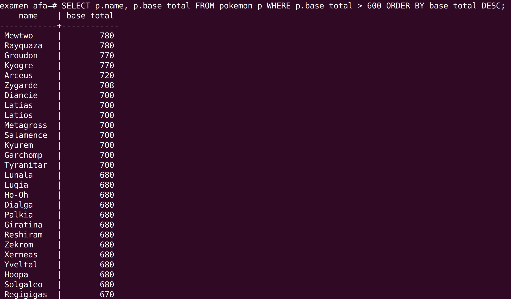
</p>
<p align="center" style="font-weight: bold;">
Figure 12: Display pokemon name and base total with two conditions.
</p>

##### SQL query 3

 Display the average base stats of Pokemon, grouped by their type, and sorts the result in ascending order according to the average:

```
SELECT 
    t.name_type AS type, 
    AVG(p.base_total)::NUMERIC AS average
FROM 
    pokemon p 
JOIN 
    pokemontype pt ON p.pokedex_number = pt.pokedex_number 
JOIN 
    types t ON t.type_id = pt.type_id 
GROUP BY 
    t.name_type 
ORDER BY 
    average;

```

<p align="center">
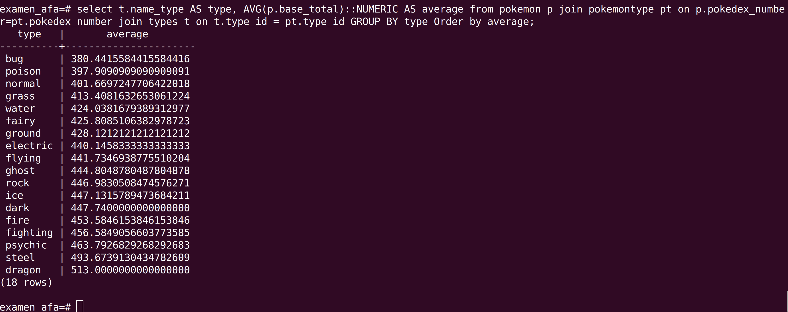
</p>
<p align="center" style="font-weight: bold;">
Figure 13: Display pokemon name and average base total with two conditions.
</p>

##### SQL query 4

List Pokemons with the special ability 'Overgrow' and sort them by base stats in descending order

```
SELECT 
    p.name, 
    p.base_total 
FROM 
    pokemon p 
JOIN 
    pokemonability pa ON p.pokedex_number = pa.pokedex_number 
JOIN 
    abilities a ON a.ability_id = pa.ability_id 
WHERE 
    a.name_ability = 'Overgrow' 
ORDER BY 
    p.base_total DESC;
```

<p align="center">
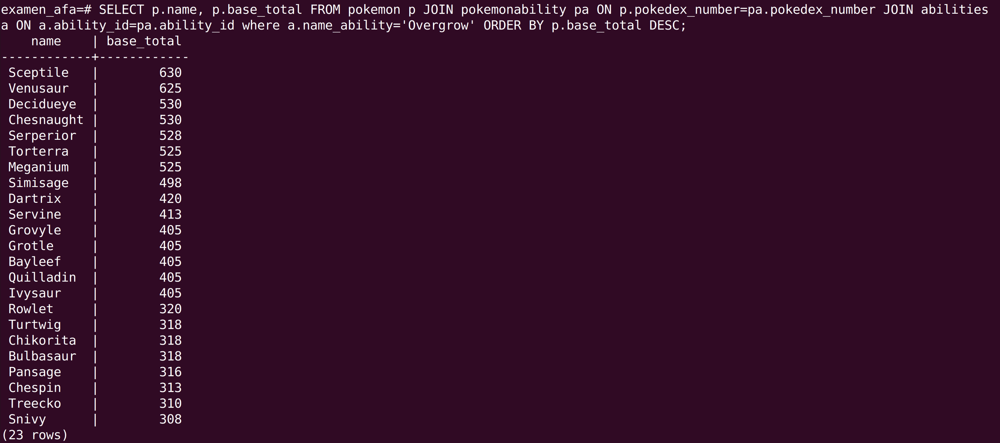
</p>
<p align="center" style="font-weight: bold;">
Figure 14: Display pokemon with special ability in descending order according to base stats.
</p>

##### SQL query 5

To list pokemon by their names and their primary and secondary types, we can group the pokemon by their names, and for each name we print the types by using conditional operations on _type\_id_ as shown by the following query:

```
SELECT 
    p.name,
    MAX(CASE WHEN pt.type_id = LEAST(pt.type_id, pt2.type_id) THEN t.name_type END) AS primary_type,
    MAX(CASE WHEN pt2.type_id IS NOT NULL AND pt.type_id = GREATEST(pt.type_id, pt2.type_id) THEN t.name_type END) AS secondary_type
FROM 
    pokemon p
JOIN 
    pokemontype pt ON p.pokedex_number = pt.pokedex_number
JOIN 
    types t ON t.type_id = pt.type_id
LEFT JOIN 
    pokemontype pt2 ON p.pokedex_number = pt2.pokedex_number AND pt.type_id != pt2.type_id
GROUP BY 
    p.name
ORDER BY 
    p.name;
```

<p align="center">
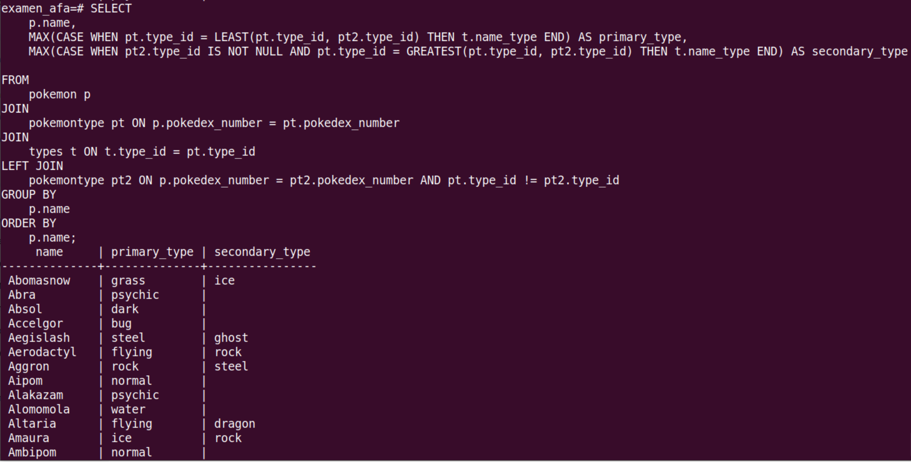
</p>
<p align="center" style="font-weight: bold;">
Figure 15: Display pokemon names and their primary and secondary types.
</p>

##### SQL query 6

Display Pokemon with a _base\_total_ greater than the average _base\_total_ per generation:

```
SELECT 
    p.name,
    p.generation,
    p.base_total AS total_stats
FROM 
    pokemon p
WHERE 
    p.base_total > (
        SELECT 
            AVG(p2.base_total)
        FROM 
            pokemon p2
        WHERE 
            p2.generation = p.generation
    );
```

<p align="center">
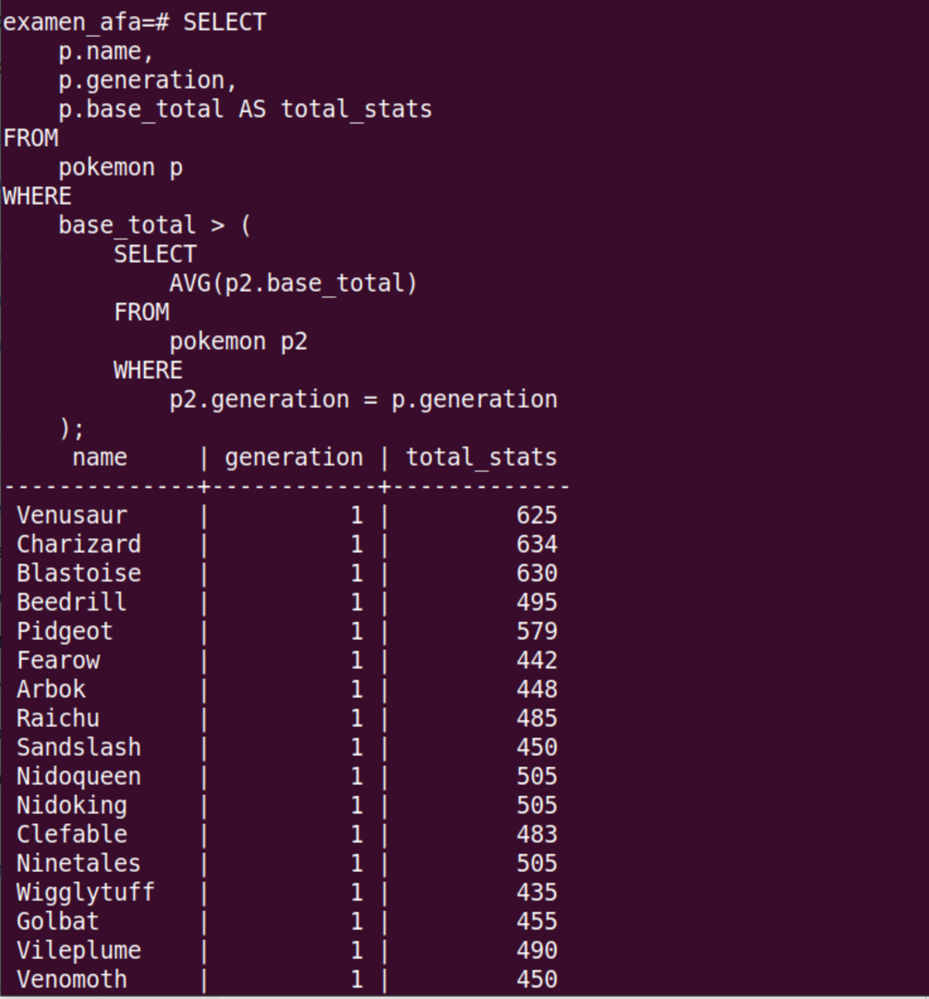
</p>
<p align="center" style="font-weight: bold;">
Figure 16: Display pokemon when base_total is greater the the average base_total per generation.
</p>

##### SQL query 7

To find pokemon of type "fire" with attack greater than 100 :

```
SELECT 
    p.name, 
    s.attack 
FROM 
    pokemon p
JOIN 
    stats s 
    ON p.pokedex_number = s.pokedex_number
JOIN 
    pokemontype pt 
    ON p.pokedex_number = pt.pokedex_number
JOIN 
    types t 
    ON t.type_id = pt.type_id
WHERE 
    t.name_type = 'fire' 
    AND s.attack > 100;
```

<p align="center">
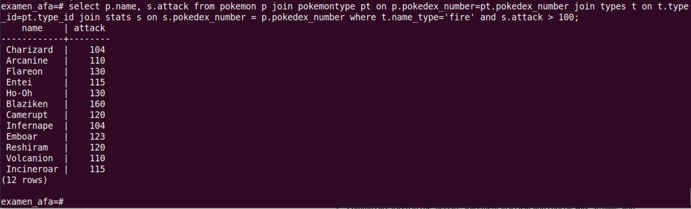
</p>
<p align="center" style="font-weight: bold;">
Figure 17: Display pokemon the type is 'fire' and the attack is greater than 100.
</p>

##### SQL query 8

Indiquer si le total des stats d'un Pokémon est supérieur ou inférieur à la moyenne par génération.
Indicate whether a Pokémon's total stats of  is great or less than the average for its generation.

```
SELECT 
    p.name,
    p.generation,
    p.base_total,
    CASE
        WHEN p.base_total > (
            SELECT AVG(p2.base_total)
            FROM pokemon p2
            WHERE p2.generation = p.generation
        ) THEN 'greater than the average'
        ELSE 'less or equal to the average'
    END AS total_stats_comparison
FROM 
    pokemon p;
```

<p align="center">
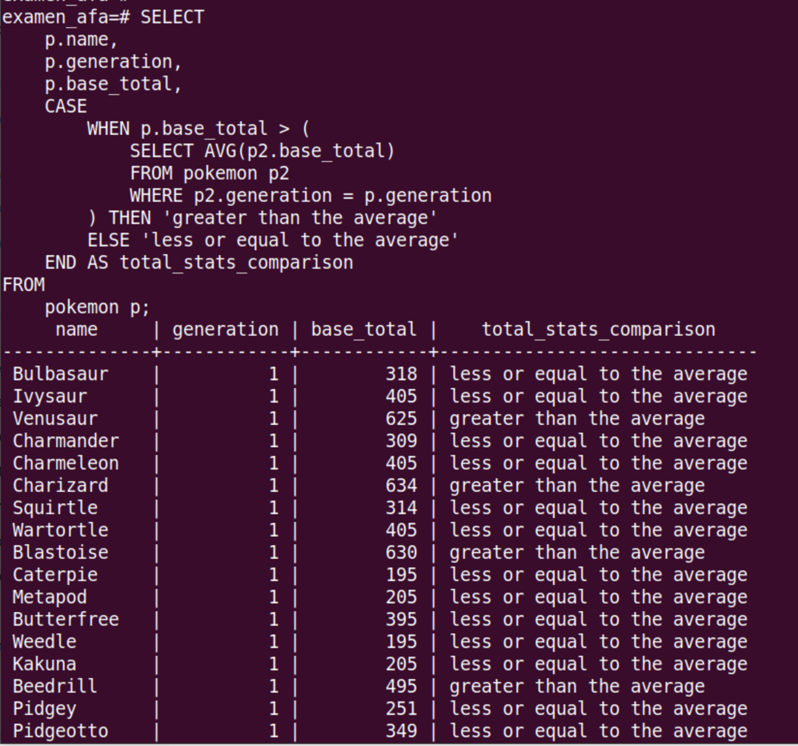
</p>
<p align="center" style="font-weight: bold;">
Figure 18: Display pokemon with new column according to a given condition.
</p>

### Part III : Automate all queries using a Python script :

In our docker there is no Python installed, so we start by installing Python3 on the alpine distribution.

We copy the Python script in the container using these commands: 
```
docker cp ./run-queries-python.py pg_container:/home

docker cp ./queries.txt pg_container:/home
```
To connect to the container : 
```
docker exec -it pg_container sh
```
Install python3 and the required dependencies : 
```
apk add --no-cache python3

apk add --no-cache py3-psycopg2
```

To run the python script, we use the following command :

```
docker exec -it pg_container python3 /home/run-queries-and-save-result-python.py
```

<p align="center">
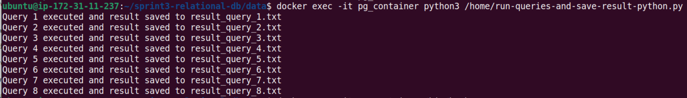
</p>
<p align="center" style="font-weight: bold;">
Figure 19: The output of the executed Python command.
</p>

##### Restaoring the Database:
To make a backup of the database :

- first create the backup inside the container, in a directory that the user _PostgreSQL_ has write access to

```
docker exec -it pg_container pg_dump -U afa_user examen_afa -f /tmp/examen_afa.sql
```

- Then we copy the backup from the container to the host machine :

```
docker cp pg_container:/tmp/examen_afa.sql .
```

<p align="center">
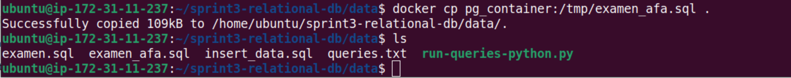
</p>
<p align="center" style="font-weight: bold;">
Figure 20: The output when copying the backup on local.
</p>


